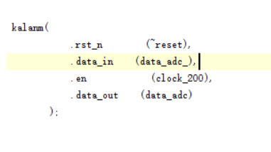

### 心电图实验的说明

我最开始是FPGA小白，通过这个实验慢慢对他有了一丁点皮毛的理解。这个项目开源主要是希望能记载一下

当然项目主要参考了(https://blog.csdn.net/m0_54544982/article/details/121090770?spm=1001.2014.3001.5506)这位大佬的文章

底层使用学校的EGO1板卡资源实现内置XADC模块读取外围的电信号。

在数字滤波上使用了卡尔曼滤波的方式，经仿真检验，在一定程度上可以克服非平稳随机信号的噪声干扰。

仿真文件已经提供MATLAB程序。

底层verilog的数字滤波卡尔曼滤波模板的代码并未提供出来，其模板可以参考文章(https://blog.csdn.net/qq_43557686/article/details/125446624)

但是其主要思路是：

因为每过200HZ后RAM会读取一次XADC的输出数据，因此基于马尔科夫链的卡尔曼滤波会每过200HZ进行一次互补滤波的计算。所以卡尔曼滤波模块的输入时钟为200HZ，和RAM的输入时钟保持一致。

